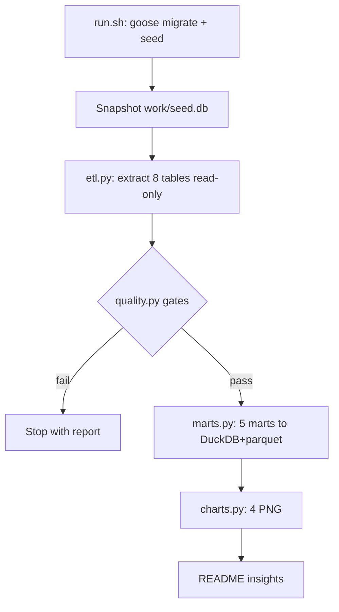

# lifeos-data

[](https://github.com/RakhaYandra/lifeos-data/actions)

> Ekosistem: [api](https://github.com/RakhaYandra/lifeos) · [web](https://github.com/RakhaYandra/lifeos-web) · [docs](https://github.com/RakhaYandra/lifeos-docs/releases) · [qa](https://github.com/RakhaYandra/lifeos-qa) · [data](https://github.com/RakhaYandra/lifeos-data) · [ops](https://github.com/RakhaYandra/lifeos-ops)

Pipeline analitik untuk database [LifeOS](https://github.com/RakhaYandra/lifeos) —
Python + pandas + DuckDB + matplotlib. Tanpa server, tanpa deploy:
outputnya marts + grafik + insight di bawah.

## Purpose, Output & Expectations

**Purpose.** A LifeOS database accumulates months of tasks, habits, and
transactions — but raw rows answer nothing. This pipeline turns the SQLite
snapshot into decisions: where money goes, which habits hold, where tasks pile up.

**Output.** 5 DuckDB marts (spending, cashflow, budget health, habit rates,
task throughput), 4 Nexus-style charts, quality gates that fail the run on
dirty data, and written insights traced to QA-verified API numbers.

**Expectations.** After `./run.sh`: identical numbers on every fresh snapshot
(deterministic seed); every insight below traceable to a mart row; zero
personal data in the repo (seed-only artifacts).

## Features

| Feature | Description |
|---|---|
| Extract | - Read-only read of 8 core tables from a snapshot copy (never the live DB). - Purpose: safe source. Output: dataframes. |
| Quality gates | - Row counts, orphan FKs, non-positive amounts, broken dates, duplicate PKs — run fails on any error. - Purpose: never analyze dirty data. Output: `quality_report.json`. |
| Marts | - `spending_daily`, `cashflow_monthly`, `budget_health`, `habit_rates`, `task_throughput` in DuckDB + parquet. - Purpose: analysis-ready tables. Output: 5 marts. |
| Charts | - 4 PNGs (spending, cashflow, habits, throughput) in Nexus dark style. - Purpose: visuals without deploying anything. Output: committable PNGs. |
| Scheduling | - Cron + systemd timer examples. - Purpose: weekly runs. Output: documented schedule. |

## Insight (run seed 2026-09-14, tertelusur ke QA)

* **Cashflow Sep: net +7.334.001** (in 10jt, out 2.665.999) — cocok dengan `GET /v1/dashboard`
* **Hunian 98,75% dari budget** (1.185.000/1.200.000, status warning); Makan 23,87%; Transport 28,8%; Hiburan 43,3%
* **Streak olahraga 20 hari**, rate 100% (28/28); baca 95% (21/22, bolong 2x)
* **Throughput tasks**: pekan W37 5 done / 3 overdue; W38 0 done / 7 overdue — menumpuk di pekan berjalan


## Cara run 5 menit

```bash
pip install -r requirements.txt
./run.sh   # bootstrap snapshot seed -> quality -> marts -> charts
```

`run.sh` mem-bootstrap `work/seed.db` (migrate + seed fiktif) bila belum ada.
Untuk analisis data pribadi: `LIFEOS_DB=/path/copy.db ./run.sh`
(DB dibaca read-only; `work/` tak di-commit).

## Struktur

```
etl.py        # extract 8 tabel (read-only)
quality.py    # gates: counts, orphan FK, nominal, tanggal, duplikat PK
marts.py      # 5 marts -> DuckDB + parquet (work/)
charts.py     # 4 PNG gaya Nexus
run.py        # orkestrasi + quality_report.json + insight
systemd-timer/# contoh cron + timer mingguan
```

## Verifikasi

* `work/quality_report.json` — 0 errors tiap run
* Angka marts = angka API (`/dashboard`, `/transactions/summary`, `/budgets`)
* Deterministik: run ulang di snapshot fresh → angka sama

## How It Works


