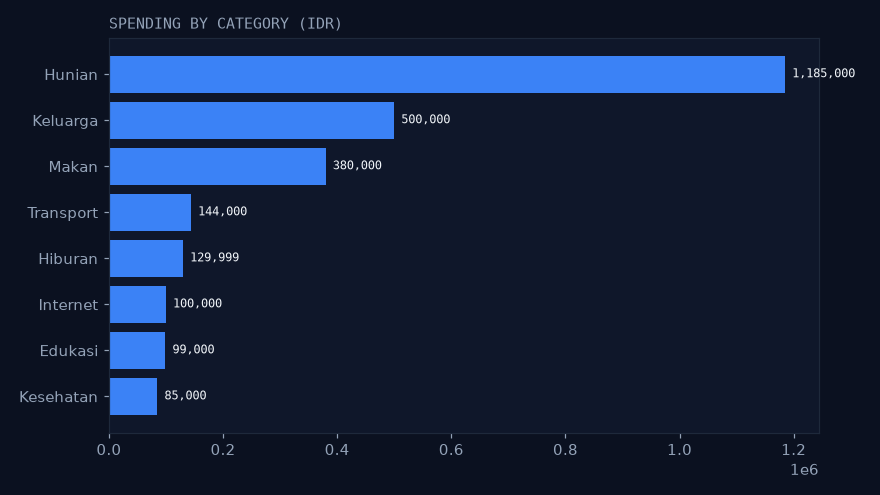
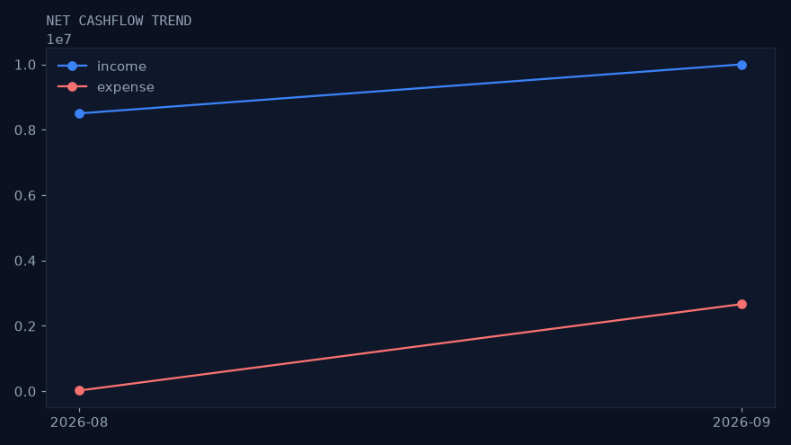
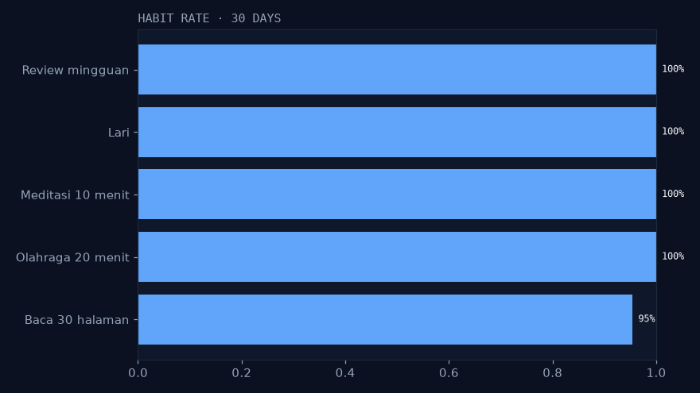
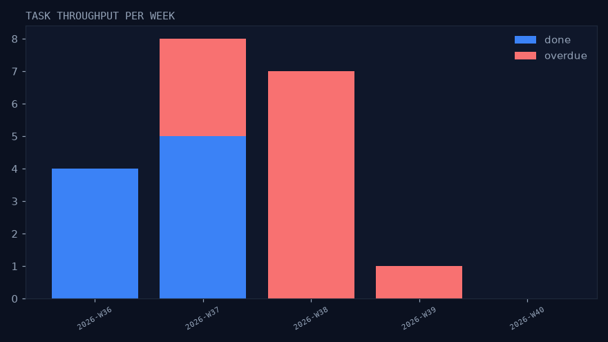

# lifeos-data

Pipeline analitik untuk database [LifeOS](https://github.com/RakhaYandra/lifeos) —
Python + pandas + DuckDB + matplotlib. Tanpa server, tanpa deploy:
outputnya marts + grafik + insight di bawah.

## Insight (run seed 2026-09-14, tertelusur ke QA)

* **Cashflow Sep: net +7.334.001** (in 10jt, out 2.665.999) — cocok dengan `GET /v1/dashboard`
* **Hunian 98,75% dari budget** (1.185.000/1.200.000, status warning); Makan 23,87%; Transport 28,8%; Hiburan 43,3%
* **Streak olahraga 20 hari**, rate 100% (28/28); baca 95% (21/22, bolong 2x)
* **Throughput tasks**: pekan W37 5 done / 3 overdue; W38 0 done / 7 overdue — menumpuk di pekan berjalan






## Cara run 5 menit

```bash
pip install -r requirements.txt
./run.sh   # bootstrap snapshot seed -> quality -> marts -> charts
```

`run.sh` mem-bootstrap `work/seed.db` (migrate + seed fiktif) bila belum ada.
Untuk analisis data pribadi: `LIFEOS_DB=/path/copy.db ./run.sh`
(DB dibaca read-only; `work/` tak di-commit).

## Struktur

```
etl.py        # extract 8 tabel (read-only)
quality.py    # gates: counts, orphan FK, nominal, tanggal, duplikat PK
marts.py      # 5 marts -> DuckDB + parquet (work/)
charts.py     # 4 PNG gaya Nexus
run.py        # orkestrasi + quality_report.json + insight
systemd-timer/# contoh cron + timer mingguan
```

## Verifikasi

* `work/quality_report.json` — 0 errors tiap run
* Angka marts = angka API (`/dashboard`, `/transactions/summary`, `/budgets`)
* Deterministik: run ulang di snapshot fresh → angka sama
